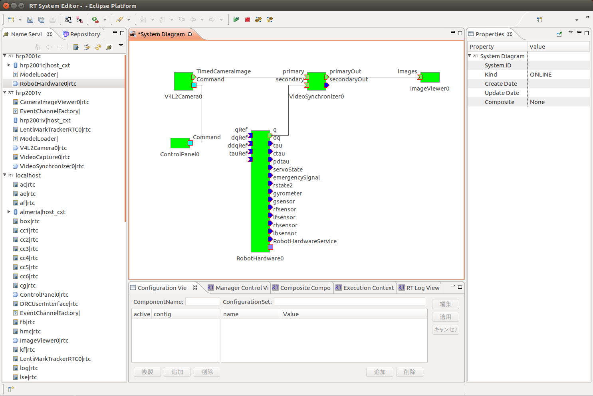

hrp5p-calib インストール／動作確認手順
===================================
------------------------------
## 概要
本ソフトウェアパッケージには、HRPロボット上でカメラとキネマティクスの同期をとるために必要な
OpenRTMのコンポーネント、カメラドライバおよびchoreonoid pluginが含まれている。主な構成要素
は次のとおりである:

1. `V4L2CameraComp`: USB接続のWEBカメラなど、Video for Linux v.2(V4L2)で駆動される
カメラから画像を取得するRTコンポーネント。基本的な機能はhrpsys-baseに含まれる
`VideoCaptureComp`と同じだが、バスを介して画像がホストPCに到着した時刻を記録する
タイムスタンプ機能や、様々なカメラパラメータを動的に変更する機能を有する。
2. `IIDCCameraComp`: IIDC規格に準拠したFireWireまたはUSB接続のカメラから画像を取得する
RTコンポーネント。機能は`V4L2CameraComp`と同じだが、カメラが画像を取得した瞬間の時刻が
タイムスタンプに記録される。
3. `VideoSynchronizerComp`: カメラからの画像とキネマティクス情報を入力し、各画像フレーム
に対して、そのタイムスタンプに最も近い時刻のキネマティクス情報を選択するRTコンポーネント。
4. `TUImageViewerPlugin`: choreonoid上に画像ストリームを表示するpluinかつ
RTコンポーネント。
5. `TUControlPanelPlugin`: choreonoidからカメラのパラメータを操作するためのpluinかつ
RTコンポーネント。

------------------------------
## インストールとカメラの動作確認
### 動作環境
以下の環境で動作確認済み

    ubuntu-14.04(64bit), ubuntu-16.04(64bit)

### 必要なパッケージのインストール
事前に必要なパッケージをインストールしておく.
```bash
$ sudo apt-get install build-essential cmake cmake-curses-gui \
  libboost-all-dev xaw3dg-dev libraw1394-dev libusb-1.0-0-dev \
  libyaml-cpp-dev libgtk2.0-dev
```
- さらにOpenRTM-1.1.2以上をインストールしておく。
- IIDC規格に準拠したFireWireまたはUSB接続のカメラを使用しない場合は、
`libraw1394-dev`,  `libusb-1.0-0-dev`は不要。
- `choreonoid`がインストール済みでこれを利用して動作確認を行う場合は、
`xaw3dg-dev`は不要。

### gcc-4.9のインストール(ubuntu-14.04のみ)
ubuntu-14.04のデフォルトのコンパイラはgcc-4.8であるが，C++14のサポートが不完全な
ため，本コードをコンパイルできない．そこで，以下の手順でgcc-4.9をインストールする．

```bash
$ sudo add-apt-repository ppa:ubuntu-toolchain-r/test

$ sudo apt-get update
$ sudo apt-get install g++-4.9

$ sudo update-alternatives --install /usr/bin/gcc gcc /usr/bin/gcc-4.8 10
$ sudo update-alternatives --install /usr/bin/gcc gcc /usr/bin/gcc-4.9 20

$ sudo update-alternatives --install /usr/bin/g++ g++ /usr/bin/g++-4.8 10
$ sudo update-alternatives --install /usr/bin/g++ g++ /usr/bin/g++-4.9 20

$ sudo rm /usr/bin/cpp
$ sudo update-alternatives --install /usr/bin/cpp cpp /usr/bin/cpp-4.8 10
$ sudo update-alternatives --install /usr/bin/cpp cpp /usr/bin/cpp-4.9 20

$ sudo update-alternatives --install /usr/bin/cc cc /usr/bin/gcc 30
$ sudo update-alternatives --set cc /usr/bin/gcc

$ sudo update-alternatives --install /usr/bin/c++ c++ /usr/bin/g++ 30
$ sudo update-alternatives --set c++ /usr/bin/g++
```
### hrp5p-calibのダウンロード
GitHubからダウンロードする．
```bash
$ git clone https://github.com/t-ueshiba/hrp5p-calib.git
```

### hrp5p-calibのコンパイルとインストール
次の手順でコンパイル，インストールする。必要に応じて、インストール場所を`CMAKE_INSTALL_PREFIX`で指定する。
デフォルトは`/usr/local`。HRP2-KAIのVision PC(`hrp2001v`)の場合は`$HOME/usr`。

```bash
$ cd hrp5p-calib
$ mkdir build
$ cd build
$ cmake -DCMAKE_INSTALL_PREFIX=$HOME/usr ..
$ make
```
- 追加でダウンロードされたソースが`$HOME/src`に展開される。
- `make install`は不要。

`CMAKE_INSTALL_PREEFIX`で指定したディレクトリを`${prefix}`とすると、
次のものがインストールされる：

##### 必ずインストールされるもの
    ${prefix}/lib/libTUTools++.so	# 様々なツールを収めたライブラリ
    ${prefix}/lib/libTUV4L2++.so	# V4L2(Video for Linux v.2)カメラを制御するライブラリ
    ${prefix}/include/TU/*        # ライブラリを利用するためのヘッダファイル
    ${prefix}/bin/testv4l2camera	# V4L2カメラ用テストプログラム
    ${prefix}/bin/V4L2CameraComp	# V4L2カメラ用を制御するRTコンポーネント
    ${prefix}/bin/V4L2MultiCameraComp	# 複数のV4L2カメラ用を同時に制御するRTコンポーネント
    ${prefix}/bin/VideoSynchronizerComp # カメラ画像とキネマティクスを同期させるRTコンポーネント

##### `libraw1394-dev`,  `libusb-1.0-0-dev`がインストール済みの場合にインストールされるもの
    ${prefix}/lib/libTUIIDC++.so	# IIDCカメラを制御するライブラリ
    ${prefix}/bin/testIIDCcamera	# IIDCカメラ用テストプログラム
    ${prefix}/bin/IIDCCameraComp	# IIDCカメラ用を制御するRTコンポーネント
    ${prefix}/bin/IIDCMultiCameraComp	# 複数のIIDCカメラ用を同時に制御するRTコンポーネント

##### `xaw3dg-dev`がインストール済みの場合にインストールされるもの
    ${prefix}/lib/libTUv++.so	          # GUIライブラリ
    ${prefix}/bin/ImageViewerComp	      # カメラ画像を表示するビューワ
    ${prefix}/bin/MultiImageViewerComp  # 複数のカメラ画像を表示するビューワ

##### `choreonoid`がインストール済みの場合にインストールされるもの
    ${cnoid_libdir}/libCnoidImageViewerPlugin.so	# カメラ画像を表示するplugin
    ${cnoid_libdir}/libCnoidMultiImageViewerPlugin.so	# 複数のカメラ画像を表示するplugin
    ${cnoid_libdir}/libCnoidControlPanelPlugin.so	# カメラ等のデバイスのパラメータをGUIから設定するplugin
    ${cnoid_libdir}/rtc/V4L2CameraRTC.so # V4L2カメラ用を制御するRTCItem化可能なRTコンポーネント
    ${cnoid_libdir}/rtc/V4L2MultiCameraRTC.so # 複数のV4L2カメラ用を制御するRTCItem化可能なRTコンポーネント
    ${cnoid_libdir}/rtc/IIDCCameraRTC.so # IIDCカメラ用を制御するRTCItem化可能なRTコンポーネント
    ${cnoid_libdir}/rtc/IIDCMultiCameraRTC.so # 複数のIIDCカメラ用を制御するRTCItem化可能なRTコンポーネント

- `${cnoid_libdir}`は、`choreonoid`のpluginを格納するディレクトリで、たとえば`$HOME/usr/lib/choreonoid-1.7`。
- `IIDCCameraRTC.so`, `IIDCMultiCameraRTC.so`は、
`libraw1394-dev`,  `libusb-1.0-0-dev`がインストール済みの場合のみインストールされる。

### 検索パスの設定
インストール場所`${prefix}`にコマンドと共有ライブラリのパスが通っていなければ、
`~/.bashrc` の中に

    export PATH=${PATH}:${prefix}/bin
    export LD_LIBRARY_PATH=${LD_LIBRARY_PATH}:${prefix}/lib

を追加してコマンドと共有ライブラリを検索可能にする．

### 一般ユーザにカメラへのアクセス権を与える
デフォルトでは一般ユーザにはFireWire/USBデバイスを直接操作する権限がないので，
これを許可するために `/etc/udev/rules.d/40-permissions.rules`という
ファイルを作る．

```bash
$ sudo vi /etc/udev/rules.d/40-permissions.rules
```
そして，以下の内容を記入する．

    SUBSYSTEM=="firewire",				GROUP="video"
    SUBSYSTEM=="usb device",				GROUP="video"
    SUBSYSTEM=="usb", ENV{DEVTYPE}=="usb_device",	GROUP="video"

これにより，グループ：video に属するユーザにアクセス権が与えられる．
そして，実際にカメラを使用するユーザを video グループに登録する．
（ubuntuの場合，videoグループ自体は既存なので，新たに作る必要はない）
```bash
$ sudo vi /etc/group
```
    ### 例：hrp2user を video に登録 ###
    video:x:44:hrp2user

### reboot
前項の設定を有効化するためにホストマシンをリブートする．
```bash
$ sudo reboot
```
再ログインして，自分がvideoグループに属していることを確かめる
```bash
$ id
```
と打ってgroups= に44(video) が表示されればOK.

### カメラ単体の動作確認とカメラ設定ファイルの生成
V4L2カメラの場合を例にして説明する。`${prefix}/bin` に実行パスが通っていることを確認した上で
```bash
$ testv4l2camera
```
と打つ．ウィンドウが開き、利用可能なカメラがあればそのデバイスファイル名`/dev/video*`が
リストに表示されるので、その一つを選択して"View"ボタンを押す。すると新たなウィンドウがポップアップ
するので、"Continous Shot"ボタンを押して画像ストリームが表示されればカメラは正常に動作している。
カメラのパラメータや画像フォーマット等をGUIから設定できる。

次に、RTコンポーネントのためのカメラ設定ファイルを生成する。上記`testv4l2camera`の最初の
ウィンドウで"Save"ボタンを押せば、全カメラの現在の設定がYAMLフォーマットで

    ${prefix}/etc/V4L2Camera.conf

に保存される。

- ファイルには全てのカメラの設定が、リストの順番で保存される。
- V4L2CameraComp, V4L2CameraRTCは、最初のカメラの設定を読み込み、2番目以降の
エントリは無視する。
- V4L2MultiCameraComp, V4L2MultiCameraRTCは、全カメラの設定を読み込み、
ファイル中の順番で番号付けする。
- よって、所望のカメラを使用するには、保存前に上/下矢印ボタンでリストの順番を変更したり、
保存後にエディタを用いて不要なカメラのエントリをファイルから削除する等の作業が必要なことがある。

### choreonoidを用いた異なるホストへのカメラ画像の表示
次に、カメラが接続されているホストから別のホストにOpenRTMを介して画像を転送できるか確認する。

まず、カメラが接続されているホスト(たとえば`hrp2001v`)において、RTコンポーネントのネームサーバ
への登録名のフォーマットと実行周期をデフォルトから変更するために、以下の内容で
`/usr/local/etc/rtc.conf`を作成する:

    # hrp2001v:/usr/local/etc/rtc.conf
    corba.nameservers: localhost
    naming.formats: %n.rtc
    logger.enable: NO
    logger.loglevel: VERBOSE
    exec_cxt.periodic.rate: 1000

そして、カメラ制御用RTコンポーネントを立ち上げる:
```bash
hrp2001v$ rtm-naming
hrp2001v$ V4L2CameraComp
```
次に、`choreonoid`がインストールされているホスト(たとえば`hrp2001t`)にも上記手順で
`hrp5p-calib`をインストールする。そして、`~/cnoid_project`下にインストールされた
`choreonoid`プロジェクトファイルを開く:
```bash
hrp2001t$ cd ~/cnoid_project
hrp2001t$ choreonoid V4L2Camera-HRP2KAI.cnoid
```
ウィンドウに"Control panel"ビューと"Image viewer"ビューが現れ、前者にカメラパラメータを
設定するGUIウィジェットが、後者にカメラからの画像がそれぞれ表示されれば正常に動作している。

------------------------------
## VideoSynchronizerCompの動作確認

以上の手順が完了しているとの前提で、カメラ画像とロボットのキネマティクスを同期させる方法を
説明する。例として、HRP2-KAIのビジョンPC(`hrp2001v`)に接続された手先カメラからの画像と
制御PC(`hrp2001c`)が取得した関節角度を`hrp2001v`上で同期させ、その結果をターミナルPC
(`hrp2001t`)上のchoreonoidに表示させることを考える。

### 制御PCとビジョンPCの時刻合わせ
キネマティクス情報と画像フレームには、それぞれ制御PC(`hrp2001c`)とビジョンPC(`hrp2001v`)
のクロックによりタイムスタンプが付される。両者の時刻合わせをするため、ソフトウェアクロックに
加えてハードウェアクロックも同期できるchoryを使用する。`hrp2001c`をタイムサーバとし、この
クロックに`hrp2001v`のクロックを同期させる。

まず、両方のPCに
```bash
% sudo apt-get install chrony
```
によってchronyをインストールする。次に、`hrp2001c:/etc/chrony/chrony.conf`に対して、
コメントアウトされている次の行を生かす:

    # hrp2001c:/etc/chrony/chrony.conf
    local stratum 10  # このホストをサーバにする

更に、次の行を追加する:

    # hrp2001c:/etc/chrony/chrony.conf
    allow 150.29.144.0/9  # subnetからの問い合わせに応じる

また、`hrp2001v:/etc/chrony/chrony.conf`には次を追加する:

    # hrp2001v:/etc/chrony/chrony.conf
    server hrp2001c prefer  # hrp2001cに優先的に問い合わせる
    stratumweight 3
    makestep 1.0 3

両ホストで
```bash
% sudo systemctl restart chrony
```
によってデーモンを再起動した後、しばらくしてから`hrp2001v`上で
```bash
hrp2001v% chronyc sources
```
と打って、同期がとれているか確認する。

### 画像ストリームとキネマティクスの同期
制御PCで
```bash
hrp2001c cd ~/usr/share/hrpsys/samples/HRP2KAI
hrp2001c sudo ./hrpsys.sh
```
と打ってRTコンポーネントを起動する。次に、ビジョンPCで
```bash
hrp2001v rtm-naming
hrp2001v V4L2CameraComp
hrp2001v VideoSynchronizerComp  #(別ウィンドウで)
```
と打ってカメラ制御と同期用のコンポーネントを起動する。最後にターミナルPCで
```bash
hrp2001t% cd ~/cnoid_project
hrp2001t% choreonoid SyncV4L2Camera-HRP2KAI.cnoid
```
と打ってコンポーネント間を接続してactivateする。これにより次のような接続状態になる:



`VideoSynchronizer0`の`primary`ポートに入力された画像は、そのまま`primaryOut`ポート
に出力される。`secondary`ポートに入力された関節角度ベクトルは、各画像フレームのタイムスタンプ
に最も近い時刻を持つものが選択されて、その画像フレームと同時に`secondaryOut`ポートに出力される。
